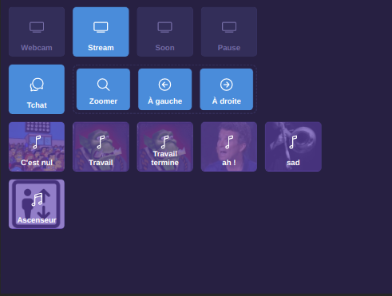

## Webdeck OBS

L'objectif du projet est de créer un streamdeck qui fonctionne sur ipad pour contrôler OBS via le [système de websocket](https://obsproject.com/forum/resources/obs-websocket-remote-control-obs-studio-from-websockets.466/).



## Configuration

Pour commencer il faut installer le plugin [OBS websocket](https://obsproject.com/forum/resources/obs-websocket-remote-control-obs-studio-from-websockets.466/) et le configurer avec un mot de passe. Ensuite vous pouvez charger le stream deck depuis l'url [stream.droapp.com](http://stream.droapp.com) (ne pas charger en HTTPS car sinon vous ne pourrez pas vous connecter au serveur de websocket).

Vous pouvez rentrer le nom d'hôte et le mot de passe via des paramètres :

```
http://stream.droapp.com/?host=192.168.0.50:4444&password=MonMotDePasse
```

Vous devriez normalement voir le sélecteur de scène apparaître.

## Les widgets

### Sélecteur de scène

Le sélecteur de scène affiche automatiquement toutes les scènes. Si vous voulez masquer une scène il faut que le nom commence par "📦".

### Lanceur de son / musiques

Les sons sont automatiquement récupérés depuis le groupe `Sounds` qui se trouve dans la scène `Stream`. Les sons doivent tous être masqués par défaut et avoir l'option "Reprendre depuis le début quand cette source redevient active" cochée.

Les musiques fonctionnent comme les sons mais doivent être placées dans le groupe `Music` de la scène `Stream`

### Tchat

Le bouton tchat permet de masquer ou d'afficher le tchat au travers d'un système de filtres configurable via le plugin[move-transition](https://obsproject.com/forum/resources/move-transition.913/). Si vous n'avez jamais utilisé ce plugin vous pouvez regarder [cette vidéo](https://youtu.be/DQNhV_bbXQ8?t=324). Vous devez créer 2 filtres `Show` et `Hide` qui doivent être sur la scène `📦 Tchat` (On utilisera ensuite cette scène dans les autres scènes).

### Position de la webcam

Le système prévoit 3 positions pour la caméra (gauche, droite et zoomée). Pour gérer ces 3 positions vous devez utiliser le système de filtre comme vu précédemment avec 3 filtres `default`, `zoom` et `left` qui doivent être placés sur la scène `Stream`.

## FAQ 

**Pourquoi avoir écrit `self = this` ?**

Je cible un ipad qui est bloqué sur ios 10.3.3 et il ne supporte pas les fonctions asynchrones fléchées.

**Pourquoi ne pas utiliser l'API Crypto du navigateur pour le SHA256 ?**

L'API Crypto ne peut être utilisé depuis un contexte HTTP. Vu que obs-websocket ne supporte pas les websockets sécurisés, on est obligé de charger la page en HTTP (on ne peut pas se connecter en websocket non sécurisé depuis une page chargée en HTTPS).
